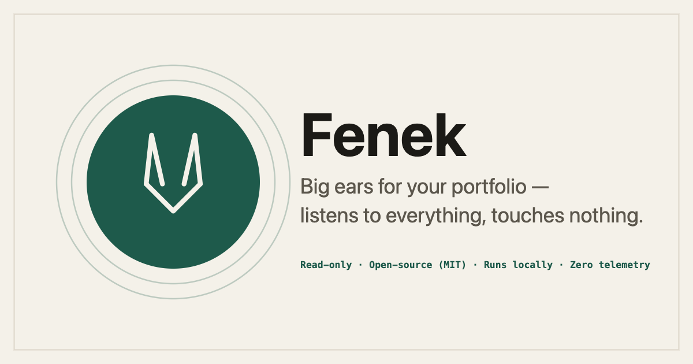

<p align="center">
  <a href="https://fenek.tech"></a>
</p>

<p align="center">
  <a href="https://fenek.tech">Website</a> ·
  <a href="https://fenek.tech/install">Install</a> ·
  <a href="https://fenek.tech/security">Security</a> ·
  <a href="https://fenek.tech/changelog">Changelog</a>
</p>

<p align="center">
  
  
  
  
  
  
</p>

# Fenek Portfolio Companion

Read-only MCP server that aggregates your portfolio data across wallets, exchanges and brokers available in Europe — currently Trading 212, Interactive Brokers (end-of-day via Flex), Bybit, and Solana, TON, Bitcoin, Litecoin and Dogecoin wallets — and makes it available to Claude to read and organize. It is a data aggregator: it reads your own data and shows neutral, descriptive figures on it, never advice and never recommendations. It places no trades, holds no funds, and has no custody. Architected to add more sources without changing the core or existing adapters.

> **NOT FINANCIAL ADVICE.** This is an informational tool. You are solely responsible for any decisions you make based on its output. The author is not a registered investment advisor in any jurisdiction. Read [DISCLAIMER.md](DISCLAIMER.md) before using.
>
> **READ-ONLY.** No tool in this server can place orders, transfer funds, or modify your account. API keys must be created with read-only permissions.
>
> **UNOFFICIAL.** Not affiliated with, endorsed by, or sponsored by Trading 212, Bybit, or any other broker, exchange, or wallet provider.
>
> **OPEN SOURCE.** MIT License, no telemetry, no affiliate relationships. Crypto features (Bybit, on-chain wallets) are part of paid Fenek Pro — under $5/mo (see [the website](https://fenek.tech)); classic brokers (Trading 212 and Interactive Brokers today, more to come) and the cross-broker overview are free forever; and building Pro from source stays officially free.

## Supported sources

Every source is read-only, opt-in, and additive — configure only the ones you use; leave the rest blank to skip them.

| Source | Type | Tier | Auth |
|---|---|---|---|
| Trading 212 | Classic broker | Free | API key + secret (read-only scopes) |
| Interactive Brokers | Classic broker — end-of-day via Flex | Free | Flex token + query ID (read-only) |
| Bybit | Crypto exchange | Pro | API key + secret (read-only) |
| On-chain wallets | Solana · TON · Bitcoin · Litecoin · Dogecoin | Pro | Public address (keyless) |

## Install

Install via Claude Desktop: *Settings → Extensions → Browse → Fenek Portfolio Companion* (once published in the Anthropic MCP Directory).

For local development install, see [CONTRIBUTING.md](CONTRIBUTING.md).

### Verify your download

If you install a `.mcpb` bundle manually from [GitHub Releases](https://github.com/Guck111/fenek-portfolio-companion/releases) instead of the directory, verify that the file was built by this repository's CI before installing it:

```sh
gh attestation verify fenek-portfolio-companion.mcpb --repo Guck111/fenek-portfolio-companion
```

This checks the bundle's cryptographic build provenance (GitHub artifact attestation). If verification fails, do not install the file.

## Configuration

When installing, Claude Desktop will prompt for:

- **Trading 212 API Key + Secret** — generated in Trading 212: *Settings → API (Beta)*. Enable **READ-ONLY** scopes only: *Account data, Portfolio, Pies — Read, History, Metadata, Orders — Read*. **Do not** enable Orders — Place, Deposits, or Withdrawals. This server does not need them and will never call them.

Whether your key belongs to a **demo** (paper) or **live** account is detected automatically from the key — there is no environment switch to set, and the server is read-only against either. New here? Run the **`/fenek_getting_started`** prompt in chat for a guided overview — it needs no keys.

Credentials are stored by Claude Desktop in your operating system's keychain (macOS Keychain / Windows Credential Manager). They are never logged, never written to disk by this server, and never transmitted anywhere except the Trading 212 API endpoints you configured. See [PRIVACY.md](PRIVACY.md).

<details>
<summary><strong>Interactive Brokers — optional</strong></summary>

You can also surface your **Interactive Brokers** account through the read-only **Flex Web Service** — no running gateway, no desktop app, no OAuth. Opt-in and additive — leave the fields blank to skip it.

- **One-time setup in IBKR Client Portal:** create an **Activity Flex Query** (*Performance & Reports → Flex Queries*) that includes the sections **Open Positions, Net Asset Value, Cash Report, Cash Transactions** (and optionally **Trades**). Then enable the **Flex Web Service** (*Settings → Account Settings → Flex Web Service*) and generate a token.
- **Flex token** — the read-only token from the Flex Web Service. You can scope its lifetime (6 hours up to a year) and optionally restrict it to an IP. Stored in your OS keychain. **It cannot place trades, move funds, or change anything** — Flex is read-only reporting by design.
- **Flex Query ID** — the identifier of the Activity Flex Query above (not a secret).

Notes and limitations:

- **End-of-day, not live.** Flex statements are reporting data as of the last business day — positions and prices are the statement's marks, not a live intraday quote. Every IBKR tool result carries an `asOf` date so you know how fresh it is.
- **One account.** A first-cut adapter reads a single account; if your Flex Query covers several, scope it to one in Client Portal.
- **Read-only and not financial advice**, exactly like the rest of this server.

</details>

<details>
<summary><strong>Crypto wallets — optional</strong></summary>

In addition to (or instead of) Trading 212, you can surface on-chain holdings by **public wallet address**. Opt-in and additive — leave the field blank to skip it entirely.

- **Wallet addresses** — paste one or more public addresses into a single field, separated by commas, spaces, or new lines. The chain of each is detected automatically from its format. Supported today: **Solana, TON, Bitcoin, Litecoin, Dogecoin**. A public address is not a secret; it cannot move funds.
- **No API keys, ever.** Every chain is read keyless via public endpoints (the Solana public RPC, [mempool.space](https://mempool.space), [blockcypher](https://www.blockcypher.com), tonapi) — nothing to sign up for. TON's non-custodial **TON Space** address is readable; the custodial Telegram `@wallet` balance is not, and is out of scope.

Notes and limitations:

- **USD valuation only.** Holdings are priced in USD via [DefiLlama](https://defillama.com). On-chain wallets carry no cost basis, so **no average price and no profit/loss** are reported for crypto. In `portfolio_overview` the crypto USD total appears as its own currency bucket alongside your Trading 212 currency — the two are never summed (no FX conversion).
- **Spam/unpriced tokens are omitted.** Only tokens with a non-zero balance and a resolvable price are shown.
- **One address, not a whole wallet.** For account chains (Solana, TON) an address is the entire account. For UTXO chains (Bitcoin, Litecoin, Dogecoin) a single address is only part of an HD wallet — paste each address you want counted; xpub expansion is out of scope.
- **Skipped addresses are reported.** If an address isn't recognized, or its chain isn't readable yet, `crypto_get_positions` lists it so you know it was skipped rather than silently dropped.
- **Jupiter limit orders (limited).** `crypto_get_limit_orders` reads open orders from Jupiter's public Trigger v1 API (no extra key — `lite-api.jup.ag`). **Heads-up:** Jupiter's current **Limit Order V2 keeps order details private** (hidden until execution), so those orders are not exposed by any public API and won't appear here — an empty result does **not** mean you have none; check jup.ag. Funds locked by open V2 orders are still visible indirectly as reduced wallet balances.
- Read-only and not financial advice, exactly like the rest of this server.

</details>

<details>
<summary><strong>Bybit — optional</strong></summary>

You can also surface your **Bybit** holdings: Unified-account coin balances, **derivatives positions** (USDT/USDC perpetuals, inverse contracts, options), **Earn / staked balances**, the **Funding wallet**, and a cross-account totals overview. Opt-in and additive — leave the fields blank to skip it. Mainnet only.

- **Bybit API key + secret** — create in Bybit: *API → API Management → Create New Key*. Choose a **System-generated** key with **Read-Only** permission. **Do not** enable Trade, Withdraw, or Transfer — this server does not need them and will never call them. The secret is shown only once; both are stored in your OS keychain.
- **Permission groups to tick** (all read-only): **Unified Trading** (balances, derivatives positions, open orders), **Assets / Wallet** (Funding wallet + the all-account overview), and **Earn** (staked/saving positions). Tools whose permission group is missing fail with a message naming exactly what to enable — `bybit_get_key_info` shows what your key can do.

What each tool reads:

- `bybit_get_positions` — UNIFIED-account coin balances valued in USD by the exchange.
- `bybit_get_account` — account totals (total equity incl. derivatives UPL), margin health rates, per-coin equity / unrealized P&L / borrow / accrued interest.
- `bybit_get_derivative_positions` — open perpetual/futures/options positions: side, size, entry/mark price, unrealized & realized P&L, leverage, liquidation price.
- `bybit_get_earn_positions` — Earn balances (flexible savings, on-chain staking, fixed-term, BYUSDT token, dual asset) with APY and accrued yield. These funds are invisible to the balance tools.
- `bybit_get_balances_overview` — total equity (USD) across **all** account types (Funding, Unified, Earn, bots, Copy Trading) plus Funding-wallet coins.
- `bybit_get_open_orders` — open (unfilled) spot + USDT/USDC linear orders.
- `bybit_get_key_info` — key diagnostics: read-only flag, permission groups, expiry warnings.

Notes and limitations:

- **USD valuation only.** Coins are valued in USD by Bybit. The exchange does not return spot cost basis, so spot balances carry **no average price / profit-loss**; derivatives positions do report unrealized and realized P&L in their settle coin. In `portfolio_overview` the Bybit USD total appears as its own currency bucket alongside your other accounts — currencies are never summed (no FX conversion).
- **Unpriced coins are omitted** from `bybit_get_positions`. Only coins with a non-zero balance and a USD value are shown.
- Read-only and not financial advice, exactly like the rest of this server.

</details>

## What it can do

- Show positions, pies (incl. dividend totals and goal progress), transactions, dividends (incl. per-share amounts and interest-type events), executed-order history with realized P&L per fill, and all-time realized P&L of the account
- Show exchange working hours (pre-market / after-hours / overnight sessions) for Trading 212 venues
- Read Interactive Brokers (end-of-day, via the read-only Flex Web Service): positions, account NAV and cash, dividends with withholding tax netted, cash transactions, and raw trade history
- Read on-chain crypto holdings (Solana, TON, Bitcoin, Litecoin, Dogecoin) by public address — keyless, valued in USD — plus look up USD prices for any watchlist coin
- See open Jupiter (Solana) limit orders — legacy Trigger v1 only; current Limit Order V2 is private (see Crypto notes)
- Read Bybit balances across **all** account types: Unified coins, Funding wallet, Earn / staked positions with APY, and total equity in USD
- Read Bybit derivatives positions (perpetuals, futures, options) with leverage, liquidation price, and P&L, plus margin health of the account
- See open (unfilled) orders on Bybit (spot + USDT/USDC perpetuals) and diagnose what the API key can access
- Compute concentration, sector overlap, currency exposure across pies
- Surface discrepancies and patterns in your holdings

## What it cannot do (by design)

- Place, modify, or cancel orders
- Transfer funds, deposit, or withdraw
- Produce personalized buy / sell / rebalance recommendations — the LLM is instructed not to (see `SERVER_INSTRUCTIONS` in [src/server.ts](src/server.ts))

## Documentation

| File | Purpose |
|---|---|
| [DISCLAIMER.md](DISCLAIMER.md) | Legal and financial disclaimers, jurisdictional notes |
| [PRIVACY.md](PRIVACY.md) | What data is and is not collected |
| [SECURITY.md](SECURITY.md) | Vulnerability disclosure process |
| [CONTRIBUTING.md](CONTRIBUTING.md) | How to contribute (DCO required) |
| [docs/adding-a-broker.md](docs/adding-a-broker.md) | Adding a new broker adapter |
| [docs/building-pro.md](docs/building-pro.md) | Building the free `freepro` flavor from source |

## Privacy Policy

This server runs entirely on your machine and sends **zero telemetry**. No analytics,
no error reporting, no usage statistics, no "phone home." The outbound network traffic
is to the broker/exchange/price API endpoints you configure (e.g. Trading 212,
the Interactive Brokers Flex Web Service, Bybit, DefiLlama, the Solana public RPC, mempool.space, blockcypher, tonapi, Jupiter),
plus an opt-out weekly version check against api.github.com (only the latest release
number is read; turn it off with `CHECK_UPDATES=false`). Your API keys are stored in your operating
system's keychain by Claude Desktop, are never logged, and are transmitted only to the
broker endpoints they belong to.

Crypto features (Bybit, on-chain wallets) are part of paid Fenek Pro; classic
brokers (Trading 212 and Interactive Brokers today, more to come) plus the cross-broker overview are
free forever. On a standard build, a Pro subscriber's build makes exactly one extra
outbound call: a monthly license check to api.polar.sh that transmits the
license key and nothing else. Free users and source builds never make it, and
building Pro from source for free stays official: see
[docs/building-pro.md](docs/building-pro.md).

Full policy: **[PRIVACY.md](PRIVACY.md)**.

## License

MIT — see [LICENSE](LICENSE).
